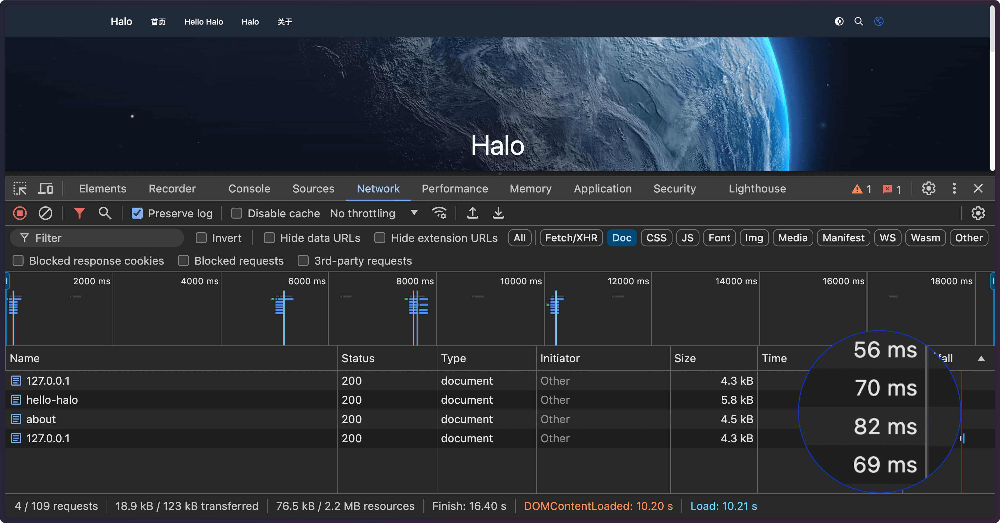
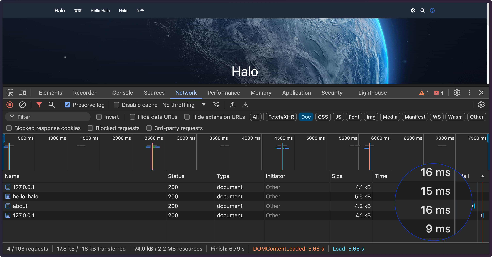

# 页面静态缓存

为 Halo 2 提供页面的静态缓存功能，提高页面访问速度。

## 使用

1. 在内置的 Halo 应用市场搜索 **页面静态缓存** 或访问 <https://www.halo.run/store/apps/app-BaamQ> 手动下载并安装。
2. 启动插件之后会自动生效。

## 注意事项

1. 当前仅支持监听文章内容的变动并自动刷新缓存，如果网站有其他内容更新并需要立即展示给访客，可以在仪表盘的快捷访问部件中找到刷新页面缓存的功能。
2. 页面缓存仅对未登录的访客有效，登录用户不会使用缓存。

## 预览

启用插件前：

启用插件后：

