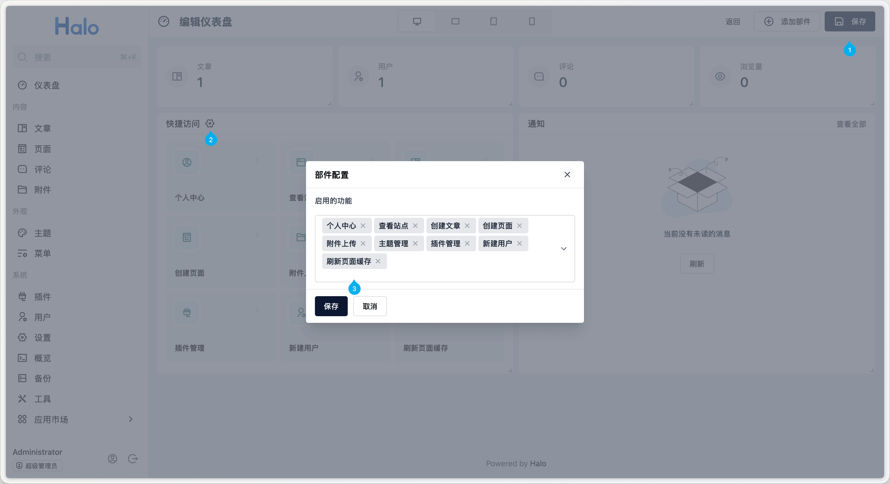
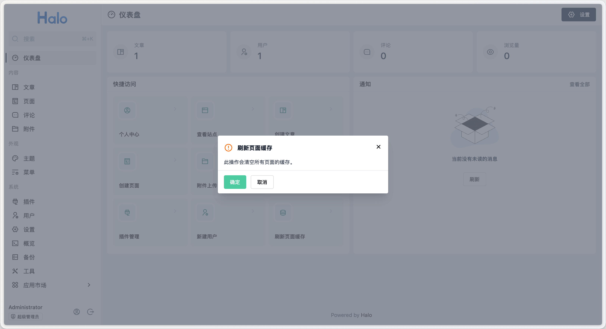
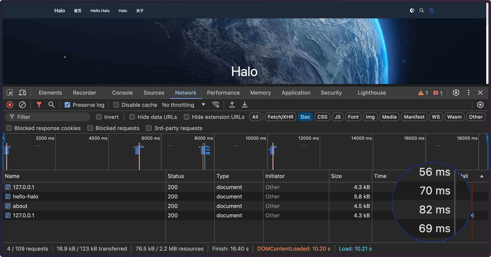
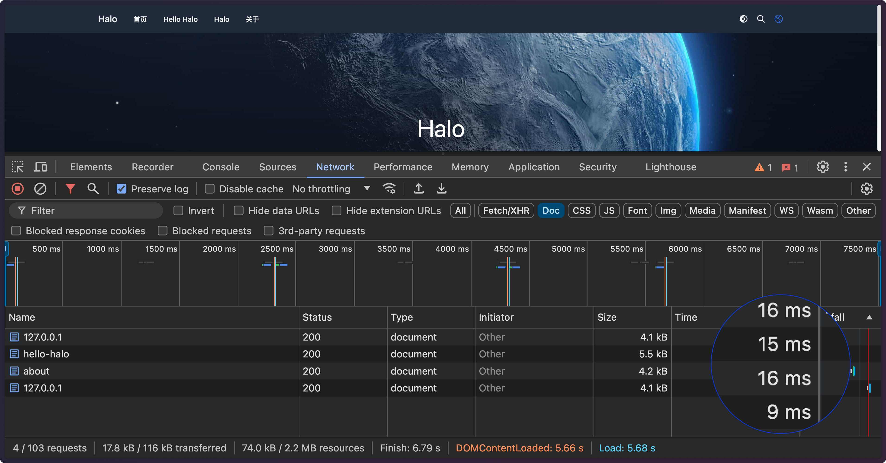

# 页面静态缓存

为 Halo 2 提供页面的静态缓存功能，提高页面访问速度。

## 使用

1. 在内置的 Halo 应用市场搜索 **页面静态缓存** 或访问 <https://www.halo.run/store/apps/app-BaamQ> 手动下载并安装。
2. 启动插件之后会自动生效。

## 缓存策略

默认情况下：

1. 只有未登录的访客访问页面时，才会创建缓存，并且用户已登录时，不会使用缓存；
2. 当前仅支持监听文章内容的变动并自动刷新缓存，如果网站有其他内容更新并需要立即展示给访客，需要手动清理缓存。

在设置中支持开启 **总是缓存**，开启之后：

已登录和未登录的用户都会使用缓存，但只有未登录用户访问时，才会创建缓存。所以如果主题中如果包含用户登录后的页面数据，则不推荐开启，否则用户登录之后可能无法看到最新的页面（比如登录后的用户名称和头像）。

如果一定要开启这个选项，建议主题中和用户相关的数据使用 API 进行异步加载。

## 手动清理缓存

手动清理缓存的入口需要在仪表盘的快捷访问中添加：

添加之后就可以点击 **刷新页面缓存** 按钮来清理缓存。

## 预览

启用插件前：

启用插件后：

